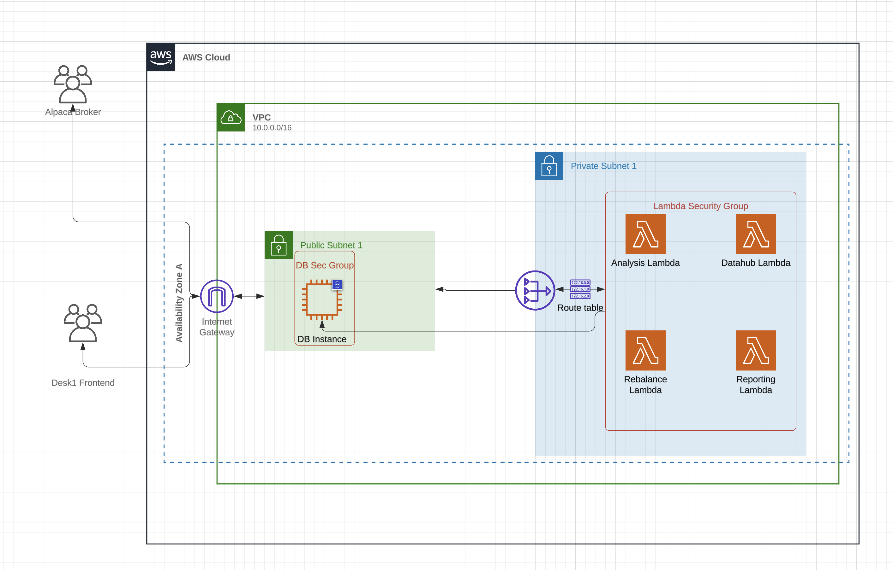

# Desk1


## Trading Platform
This is the backend for a trading algorithm that uses alpaca and AWS. The repo is primarily responsible for gathering financial data, performing analysis on that data, and placing trades through Alpaca. All of this data is written to a database running in the cloud.

### Infrastructure


### Description
The heart of this program is a quadratic programming algorithm through CVXOPT. More details here: https://cvxopt.org/examples/book/portfolio.html & https://web.stanford.edu/~boyd/cvxbook/. 

Visit https://deskonetrading.com to learn more about the program.

### Setup
You must have a root level .env file with your credentials in it. Once you have a ubuntu server running in the cloud, run the following commands to set up mysql:

```
sudo apt-get update
sudo apt-get install mysql-server
sudo vim /etc/mysql/mysql.conf.d/mysqld.cnf -> bind address: 0.0.0.0
sudo systemctl restart mysql-server
```

Next go in to mysql and create a user that can create remote connections:

```
CREATE USER 'xxx'@'localhost' IDENTIFIED BY 'xxx';
GRANT ALL PRIVILEGES ON *.* TO 'xxx'@'localhost'
    WITH GRANT OPTION;
CREATE USER 'xxx'@'%' IDENTIFIED BY 'xxx';
GRANT ALL PRIVILEGES ON *.* TO 'xxx'@'%'
    WITH GRANT OPTION;
```

### Testing
Running `make test` should run unit tests.

### Deploying
Running `make deploy` should deploy infrastructure, and `make deployLambdas` should deploy the lambda functions 
